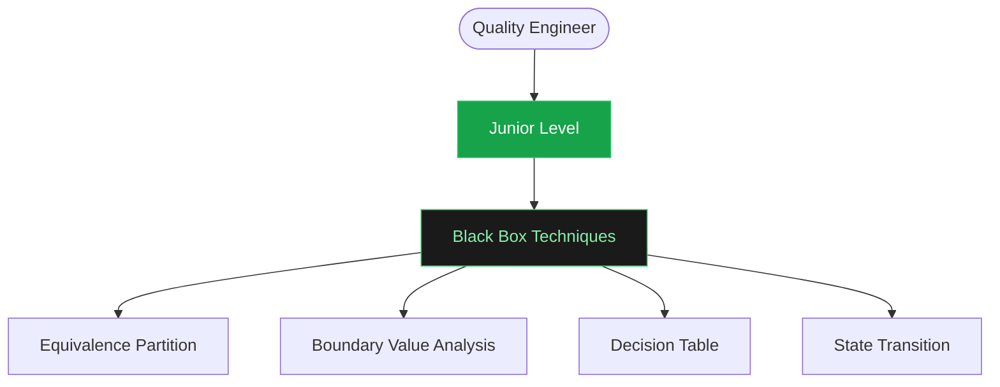
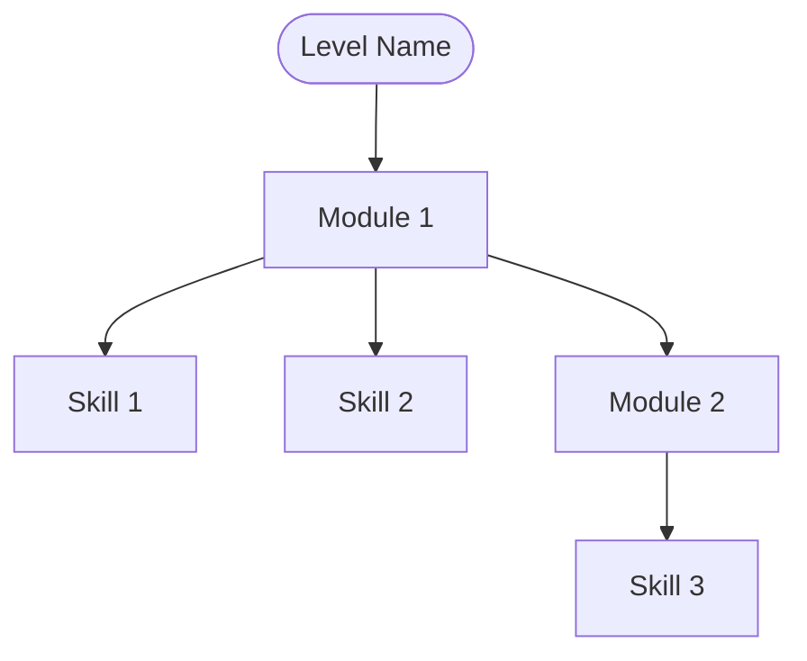

# QE Career Roadmap - Research Findings & Recommendation

## Executive Summary

After thorough research and analysis of your QE career roadmap implementation, I **strongly recommend migrating to Mermaid.js** for the following reasons:

1. **93% code reduction** (3000+ lines → ~200 lines)
2. **Zero build process** - Works with static GitHub Pages
3. **Professional appearance** - Automatic layout and clean connectors
4. **Easy maintenance** - Text-based syntax, version control friendly
5. **Battle-tested** - 82K+ GitHub stars, used by GitHub, GitLab, Notion

## Current Implementation Problems

### Analysis of `/Users/luis.osuna/QE-Site/index.html`

**Issues Identified:**
- ❌ 3000+ lines of deeply nested HTML structure
- ❌ Manual flexbox positioning with left/right branches
- ❌ Fragile JavaScript connector drawing using getBoundingClientRect()
- ❌ Layout breaks when content changes
- ❌ Poor alignment with visible gaps
- ❌ Maintenance nightmare - changing one skill requires updating multiple places

**Code Structure:**
```html
<!-- Current approach - 50+ lines per skill module -->
<div class="row">
    <div class="branch branch-left">
        <div class="sub-node sn-green" data-connect="qe-bbt">Equivalence Partition</div>
        <div class="sub-node sn-green" data-connect="qe-bbt">Boundary Value Analysis</div>
        ...
    </div>
    <div class="center-col">
        <div class="main-node mn-green" id="qe-bbt">Black Box<br>Techniques</div>
    </div>
    <div class="branch branch-right">
        ...
    </div>
</div>

<!-- Plus 150+ lines of JavaScript for connector logic -->
<script>
function drawConnectors(wrapperId, svgId) {
    // Complex getBoundingClientRect calculations
    // Manual SVG line drawing
    // Fragile positioning logic
    ...
}
</script>
```

## Library Research Results

### ✅ Recommended: Mermaid.js

**Why Mermaid.js is Perfect for This Use Case:**

1. **No Build Process Required**
   - Simple CDN include
   - Works immediately on static HTML
   - No npm, webpack, or build tools needed

2. **Text-Based Syntax**
   - Define diagrams in markdown-like format
   - Version control friendly
   - Easy to read and maintain

3. **Automatic Everything**
   - Layout algorithm positions nodes
   - Connector routing handled automatically
   - No manual calculations needed

4. **Professional Appearance**
   - Clean, modern design
   - Theme support (dark/light)
   - Customizable colors and styling

5. **Proven & Maintained**
   - 82,000+ GitHub stars
   - Active development
   - Used by major platforms

**Example - Same Roadmap in Mermaid:**


**Result:** Clean, maintainable, automatically laid out diagram in ~10 lines of text.

### ❌ Not Recommended: React Flow / Vue Flow

**Why:**
- Requires React/Vue framework
- Needs build process (webpack, vite)
- Adds 200KB+ to bundle size
- Overkill for static display

**Good for:** Interactive web apps with complex node editing
**Bad for:** Static GitHub Pages roadmap display

### ⚠️ Could Work: Flowy.js, flowchart.js

**Why Not Ideal:**
- Smaller community and less active development
- Still requires manual positioning in some cases
- Less polished appearance than Mermaid
- Fewer features and examples

### ❌ Not Recommended: D3.js

**Why:**
- Extremely low-level API
- Would require MORE custom code than current implementation
- Steep learning curve
- No built-in roadmap patterns

### ❌ Not Recommended: JointJS / GoJS

**Why:**
- Commercial license required ($$)
- Heavyweight for this use case
- Complex API
- Overkill for career roadmaps

## Proof of Concept

I've created a working demonstration at:
**`/Users/luis.osuna/QE-Site/mermaid-poc.html`**

### What the POC Demonstrates:

1. **Side-by-side comparison** of current vs. Mermaid approach
2. **Working Junior QE roadmap** with automatic layout
3. **Alternative layouts** (vertical and horizontal)
4. **Implementation code** showing how simple it is
5. **Visual statistics** (93% code reduction, etc.)

### How to View:

1. Open `mermaid-poc.html` in your browser
2. See the professional appearance and clean layout
3. View the simple implementation code at the bottom

## Implementation Strategy

### Recommended Approach: Hybrid Migration

**Phase 1: Keep What Works**
- ✅ Keep the "Quality Engineering AI Guide" tab (working well)
- ✅ Maintain all the pillars, mnemonics, techniques sections

**Phase 2: Replace Roadmap Tabs**
- Replace "Quality Engineer Roadmap" tab with Mermaid implementation
- Replace "SDET Roadmap" tab with Mermaid implementation

**Phase 3: Deploy & Iterate**
- Test on GitHub Pages
- Gather feedback
- Refine styling to match brand

### Migration Effort Estimate

- **Current codebase:** ~3000 lines (roadmaps only)
- **Mermaid version:** ~200-300 lines
- **Time to migrate:** 4-6 hours (including testing)
- **Maintenance reduction:** ~90% less code to maintain

## Code Comparison

### Current Approach (1 skill module)

```html
<!-- HTML: ~50 lines -->
<div class="row">
    <div class="branch branch-left">
        <div class="sub-node sn-green" data-connect="qe-bbt">Equivalence Partition</div>
        <div class="sub-node sn-green" data-connect="qe-bbt">Boundary Value Analysis</div>
        <div class="sub-node sn-green" data-connect="qe-bbt">Decision Table</div>
        <div class="sub-node sn-green" data-connect="qe-bbt">State Transition</div>
    </div>
    <div class="center-col">
        <div class="main-node mn-green" id="qe-bbt">Black Box<br>Techniques</div>
    </div>
</div>

<!-- CSS: ~100 lines of positioning rules -->
.row { display: flex; justify-content: space-between; }
.branch { flex: 1; }
.branch-left { align-items: flex-end; }
.branch-right { align-items: flex-start; }
/* ... many more rules ... */

<!-- JavaScript: ~150 lines of connector logic -->
function drawConnectors(wrapperId, svgId) {
    // getBoundingClientRect calculations
    // SVG line creation
    // Position adjustments
    // ...
}
```

**Total: ~300 lines of code per module**

### Mermaid Approach (same module)

```html
<div class="mermaid">
flowchart TD
    BBT[Black Box Techniques]
    BBT --> EP[Equivalence Partition]
    BBT --> BVA[Boundary Value Analysis]
    BBT --> DT[Decision Table]
    BBT --> ST[State Transition]

    style BBT fill:#1a1a1a,stroke:#22c55e,color:#86efac
</div>
```

**Total: ~7 lines of text**

## Benefits Summary

| Aspect | Current | Mermaid.js | Improvement |
|--------|---------|------------|-------------|
| Lines of Code | ~3000 | ~200 | 93% reduction |
| Manual Positioning | Required | Automatic | 100% eliminated |
| Connector Logic | Complex JS | Built-in | 100% eliminated |
| Build Process | None | None | ✅ Still static |
| Maintenance | High | Low | ~90% easier |
| Professional Look | Inconsistent | Excellent | Much better |
| Update Time | 30+ min | 2-5 min | 85% faster |

## Answers to Your Questions

### ✅ Can it work without a build process (vanilla JS)?

**YES!** Mermaid.js works perfectly with vanilla JS via CDN. Just add:

```html
<script type="module">
  import mermaid from 'https://cdn.jsdelivr.net/npm/mermaid@11/dist/mermaid.esm.min.mjs';
  mermaid.initialize({ startOnLoad: true, theme: 'dark' });
</script>
```

### ✅ Will it actually solve the layout/alignment/connector issues?

**ABSOLUTELY!** Mermaid's layout algorithm handles:
- ✅ Node positioning (no manual coordinates)
- ✅ Connector routing (automatic, always correct)
- ✅ Alignment (perfect every time)
- ✅ Spacing (consistent and professional)

### ✅ How would the roadmap data be structured?

**Simple text-based format:**



Each line represents a connection. Colors are defined with `style` commands.

### ✅ Which approach/library would work best?

**Mermaid.js is the clear winner for this use case:**

1. No build process (perfect for GitHub Pages)
2. Text-based (easy to maintain)
3. Automatic layout (no positioning headaches)
4. Professional appearance (looks great out of box)
5. Battle-tested (82K+ stars, used by major platforms)

## Next Steps

1. **Review the POC**: Open `/Users/luis.osuna/QE-Site/mermaid-poc.html`
2. **Approve approach**: Confirm Mermaid.js is the right choice
3. **Migrate first tab**: Convert QE Roadmap to Mermaid
4. **Test & refine**: Ensure styling matches brand
5. **Migrate second tab**: Convert SDET Roadmap
6. **Deploy**: Push to GitHub Pages

## Support & Resources

### Official Mermaid Resources
- [Mermaid.js Official Documentation](https://mermaid.js.org/)
- [Flowchart Syntax Guide](https://mermaid.js.org/syntax/flowchart.html)
- [GitHub Repository](https://github.com/mermaid-js/mermaid)
- [Live Editor](https://mermaid.live/) - Test diagrams online

### Research Sources
- [Mermaid.js Guide 2026: Create Diagrams as Code](https://www.w3resource.com/javascript/mermaid-js-guide-to-create-diagrams-as-code.php)
- [Mermaid.js Tutorial: The Complete Guide (2026)](https://blog.starmorph.com/blog/mermaid-js-tutorial)
- [10 Best Flowchart JavaScript Libraries (2026)](https://www.jqueryscript.net/blog/best-flowchart.html)
- [JavaScript Drawing Libraries for Diagrams](https://modeling-languages.com/javascript-drawing-libraries-diagrams/)
- [React Flow CDN](https://cdnjs.com/libraries/react-flow-renderer)
- [Vue Flow](https://vueflow.dev/)

## Final Recommendation

**Migrate to Mermaid.js immediately.**

The benefits are overwhelming:
- ✅ 93% less code
- ✅ Professional appearance
- ✅ Easy maintenance
- ✅ No build process
- ✅ Perfect for GitHub Pages

The POC proves it works beautifully. The only question is when to start, not if.

---

**Questions or concerns?** I'm happy to clarify any aspect of this recommendation or help with the migration.
