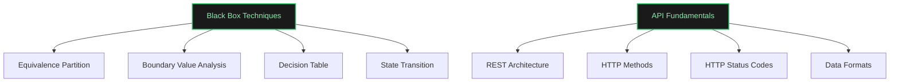
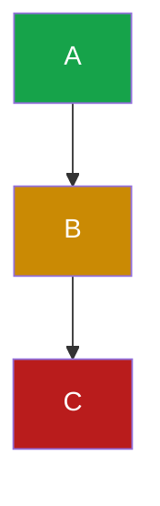

# QE Roadmap Migration Guide: HTML → Mermaid.js

## Quick Reference: Conversion Examples

### Before: Current HTML Approach

```html
<div class="row">
    <div class="branch branch-left">
        <div class="sub-node sn-green" data-connect="qe-bbt">Equivalence Partition</div>
        <div class="sub-node sn-green" data-connect="qe-bbt">Boundary Value Analysis</div>
        <div class="sub-node sn-green" data-connect="qe-bbt">Decision Table</div>
        <div class="sub-node sn-green" data-connect="qe-bbt">State Transition</div>
    </div>
    <div class="center-col">
        <div class="main-node mn-green" id="qe-bbt">Black Box<br>Techniques</div>
        <div class="main-node mn-green" id="qe-apif">API Fundamentals</div>
    </div>
    <div class="branch branch-right">
        <div class="sub-node sn-green" data-connect="qe-apif">REST Architecture</div>
        <div class="sub-node sn-green" data-connect="qe-apif">HTTP Methods</div>
        <div class="sub-node sn-green" data-connect="qe-apif">HTTP Status Codes</div>
        <div class="sub-node sn-green" data-connect="qe-apif">Data Formats</div>
    </div>
</div>

<!-- Plus CSS positioning rules -->
<!-- Plus JavaScript connector drawing -->
```

### After: Mermaid Syntax



**Result:** 50+ lines → 14 lines, automatic layout, perfect connectors

---

## Color Scheme Mapping

### Your Current CSS Variables → Mermaid Styles

```javascript
// Junior Level - Green
style NodeName fill:#1a1a1a,stroke:#22c55e,stroke-width:2px,color:#86efac

// Intermediate Level - Yellow
style NodeName fill:#1a1a1a,stroke:#eab308,stroke-width:2px,color:#fef08a

// Senior Level - Red
style NodeName fill:#1a1a1a,stroke:#dc2626,stroke-width:2px,color:#fca5a5

// Level Headers (large nodes)
style LevelName fill:#16a34a,stroke:#22c55e,stroke-width:2px,color:#fff  // Junior
style LevelName fill:#ca8a04,stroke:#eab308,stroke-width:2px,color:#fff  // Intermediate
style LevelName fill:#b91c1c,stroke:#dc2626,stroke-width:2px,color:#fff  // Senior
```

---

## Complete QE Roadmap in Mermaid

Here's how the entire Junior section would look in Mermaid:

```mermaid
flowchart TD
    Start([Quality Engineer Career Path])

    %% Junior Level
    Start --> Junior[JUNIOR LEVEL]

    Junior --> BBT[Black Box Techniques]
    Junior --> API[API Fundamentals]
    Junior --> SQL[SQL Fundamentals]
    Junior --> APITEST[API Testing Fundamentals]
    Junior --> ST[Software Testing Fundamentals]
    Junior --> PROG[Programming Basics]
    Junior --> AI[AI Fundamentals]
    Junior --> PE[Prompt Engineering Basics]
    Junior --> CE[Context Engineering Basics]

    %% Black Box Techniques
    BBT --> EP[Equivalence Partition]
    BBT --> BVA[Boundary Value Analysis]
    BBT --> DT[Decision Table]
    BBT --> STATE[State Transition]

    %% API Fundamentals
    API --> REST[REST Architecture]
    API --> HTTP[HTTP Methods]
    API --> STATUS[HTTP Status Codes]
    API --> DATA[Data Formats]
    API --> JSON[JSON & Headers]
    API --> AUTH[Authentication Basics]

    %% SQL Fundamentals
    SQL --> SELECT[SELECT Statement]
    SQL --> WHERE[WHERE & Operators]
    SQL --> JOIN[Basic Joins]
    SQL --> ORDER[ORDER BY & LIMIT]
    SQL --> AGG[Aggregates Intro]

    %% API Testing Fundamentals
    APITEST --> PM[Postman]
    APITEST --> COLL[Collections]
    APITEST --> REQ[Requests]
    APITEST --> VAR[Variables]
    APITEST --> VALID[Status Code Validation]
    APITEST --> PAYLOAD[Payload & Schema]
    APITEST --> HEADER[Header Verification]

    %% Software Testing Fundamentals
    ST --> LIFECYCLE[Testing Lifecycle]
    ST --> BUGLIFE[Bug Lifecycle]
    ST --> TYPES[Types of Testing]
    ST --> REGR[Regression/Smoke/E2E]
    ST --> FUNC[Functional/Integration]
    ST --> TC[Test Case Design]

    %% Programming Basics
    PROG --> OOP[OOP Fundamentals]
    PROG --> VARS[Variables & Constants]
    PROG --> FUNCS[Functions/Methods]
    PROG --> ARRAYS[Arrays & Lists]
    PROG --> LOOPS[Loops & Conditionals]
    PROG --> DEBUG[Basic Debugging]

    %% AI Fundamentals
    AI --> WHAT[What is AI]
    AI --> ML[ML vs Deep Learning]
    AI --> LLM[LLMs Explained]
    AI --> TOOLS[AI Tools Overview]
    AI --> GPT[ChatGPT/Claude/Gemini]
    AI --> COPILOT[GitHub Copilot]
    AI --> LIMITS[AI Limitations & Risks]

    %% Prompt Engineering Basics
    PE --> ANATOMY[Good Prompt Anatomy]
    PE --> CLEAR[Clear Instructions]
    PE --> OUTPUT[Expected Output Format]
    PE --> PATTERNS[Basic Patterns]
    PE --> QUESTION[Question/Task Prompts]
    PE --> ROLE[Role Assignment]
    PE --> MISTAKES[Common Mistakes]

    %% Context Engineering Basics
    CE --> CONTEXT[What is Context]
    CE --> TOKENS[Tokens Explained]
    CE --> WINDOW[Context Window Limits]
    CE --> EFFECTIVE[Effective Context]
    CE --> BACKGROUND[Background Info]
    CE --> EXAMPLES[Examples & Rules]

    %% Intermediate Level
    Junior --> Intermediate[INTERMEDIATE 1-4]

    Intermediate --> ADVAPI[Advanced API Testing]
    Intermediate --> ACC[Accessibility Testing]
    Intermediate --> MOB[Mobile Testing]
    Intermediate --> ADVPROG[Programming Advanced]
    Intermediate --> SQLI[SQL Intermediate]
    Intermediate --> AIDD[AI Deep Dive]
    Intermediate --> PEI[Prompt Engineering Intermediate]
    Intermediate --> CEI[Context Engineering Intermediate]

    %% Advanced API Testing
    ADVAPI --> NEWMAN[Postman/Newman]
    ADVAPI --> NEWMAN1[Executing Newman Locally]
    ADVAPI --> NEWMAN2[JavaScript Validations]
    ADVAPI --> SWAGGER[Swagger]
    ADVAPI --> DD[Data-Driven & Parameterized]
    ADVAPI --> RBAC[Authentication & RBAC]

    %% Accessibility Testing
    ACC --> WCAG[WCAG Principles]
    ACC --> LEVEL[Level A/AA/AAA]
    ACC --> CONTRAST[Color Contrast]
    ACC --> ARIA[ARIA Testing]
    ACC --> KEYBOARD[Keyboard Accessibility]

    %% Mobile Testing
    MOB --> MOBTECH[Mobile Testing Techniques]
    MOB --> INTERRUPT[Interruption/Localization]
    MOB --> PERF[Performance/Network]
    MOB --> PLATFORM[Platforms]
    MOB --> NATIVE[Native/Hybrid/Responsive]
    MOB --> DEVICES[Real Devices/Emulators]

    %% Senior Level
    Intermediate --> Senior[SENIOR 1-2]

    Senior --> FRAMEWORK[Test Framework Architecture]
    Senior --> CICD[CI/CD Mastery]
    Senior --> MENTOR[Team Leadership & Mentoring]
    Senior --> STRATEGY[Quality Strategy]

    %% Styling - Start node
    style Start fill:#2563eb,stroke:#60a5fa,stroke-width:3px,color:#fff

    %% Styling - Level headers
    style Junior fill:#16a34a,stroke:#22c55e,stroke-width:2px,color:#fff
    style Intermediate fill:#ca8a04,stroke:#eab308,stroke-width:2px,color:#fff
    style Senior fill:#b91c1c,stroke:#dc2626,stroke-width:2px,color:#fff

    %% Styling - Junior modules (green)
    style BBT fill:#1a1a1a,stroke:#22c55e,stroke-width:2px,color:#86efac
    style API fill:#1a1a1a,stroke:#22c55e,stroke-width:2px,color:#86efac
    style SQL fill:#1a1a1a,stroke:#22c55e,stroke-width:2px,color:#86efac
    style APITEST fill:#1a1a1a,stroke:#22c55e,stroke-width:2px,color:#86efac
    style ST fill:#1a1a1a,stroke:#22c55e,stroke-width:2px,color:#86efac
    style PROG fill:#1a1a1a,stroke:#22c55e,stroke-width:2px,color:#86efac
    style AI fill:#1a1a1a,stroke:#22c55e,stroke-width:2px,color:#86efac
    style PE fill:#1a1a1a,stroke:#22c55e,stroke-width:2px,color:#86efac
    style CE fill:#1a1a1a,stroke:#22c55e,stroke-width:2px,color:#86efac

    %% Styling - Intermediate modules (yellow)
    style ADVAPI fill:#1a1a1a,stroke:#eab308,stroke-width:2px,color:#fef08a
    style ACC fill:#1a1a1a,stroke:#eab308,stroke-width:2px,color:#fef08a
    style MOB fill:#1a1a1a,stroke:#eab308,stroke-width:2px,color:#fef08a
    style ADVPROG fill:#1a1a1a,stroke:#eab308,stroke-width:2px,color:#fef08a
    style SQLI fill:#1a1a1a,stroke:#eab308,stroke-width:2px,color:#fef08a
    style AIDD fill:#1a1a1a,stroke:#eab308,stroke-width:2px,color:#fef08a
    style PEI fill:#1a1a1a,stroke:#eab308,stroke-width:2px,color:#fef08a
    style CEI fill:#1a1a1a,stroke:#eab308,stroke-width:2px,color:#fef08a

    %% Styling - Senior modules (red)
    style FRAMEWORK fill:#1a1a1a,stroke:#dc2626,stroke-width:2px,color:#fca5a5
    style CICD fill:#1a1a1a,stroke:#dc2626,stroke-width:2px,color:#fca5a5
    style MENTOR fill:#1a1a1a,stroke:#dc2626,stroke-width:2px,color:#fca5a5
    style STRATEGY fill:#1a1a1a,stroke:#dc2626,stroke-width:2px,color:#fca5a5
```



---

## HTML Template for Your Site

Replace your current roadmap tab content with:

```html
<div class="tab-content" id="tab-qe">
    <div class="diagram-container">
        <div class="diagram-header">
            <h2 style="color: var(--blue-light);">Software Quality Assurance Roadmap</h2>
            <p>Career roadmap for testing strategy, process excellence, and AI-augmented QA</p>
        </div>

        <div class="legend">
            <div class="legend-item">
                <div class="legend-dot" style="background:var(--green);"></div> Junior
            </div>
            <div class="legend-item">
                <div class="legend-dot" style="background:var(--yellow);"></div> Intermediate 1-4
            </div>
            <div class="legend-item">
                <div class="legend-dot" style="background:var(--red);"></div> Senior 1-2
            </div>
        </div>

        <div class="diagram-scroll">
            <div class="mermaid">
                <!-- Paste the Mermaid flowchart code here -->
                flowchart TD
                    Start([Quality Engineer Career Path])
                    Start --> Junior[JUNIOR LEVEL]
                    Junior --> BBT[Black Box Techniques]
                    BBT --> EP[Equivalence Partition]
                    BBT --> BVA[Boundary Value Analysis]
                    <!-- ... rest of diagram ... -->

                    style Start fill:#2563eb,stroke:#60a5fa,color:#fff
                    style Junior fill:#16a34a,stroke:#22c55e,color:#fff
                    style BBT fill:#1a1a1a,stroke:#22c55e,color:#86efac
            </div>
        </div>
    </div>
</div>
```

---

## CSS Updates

Add this to your existing styles:

```css
/* Mermaid diagram container */
.mermaid {
    display: flex;
    justify-content: center;
    background: var(--bg-elevated);
    border-radius: 12px;
    padding: 32px;
    min-height: 400px;
}

.mermaid svg {
    max-width: 100%;
    height: auto;
}
```

---

## Mermaid Configuration

Add this script in your `<head>` section:

```html
<script type="module">
  import mermaid from 'https://cdn.jsdelivr.net/npm/mermaid@11/dist/mermaid.esm.min.mjs';
  mermaid.initialize({
    startOnLoad: true,
    theme: 'dark',
    themeVariables: {
      primaryColor: '#1a1a1a',
      primaryTextColor: '#fff',
      primaryBorderColor: '#22c55e',
      lineColor: '#60a5fa',
      secondaryColor: '#2a2a2a',
      tertiaryColor: '#0a0a0a',
      fontSize: '14px',
      fontFamily: 'Inter, system-ui, sans-serif'
    },
    flowchart: {
      curve: 'basis',           // Smooth curves
      padding: 20,              // Padding around diagram
      nodeSpacing: 60,          // Space between nodes horizontally
      rankSpacing: 80,          // Space between levels vertically
      useMaxWidth: true,        // Responsive width
      htmlLabels: true          // Allow HTML in labels
    }
  });
</script>
```

---

## Node Types & Syntax Reference

### Basic Nodes

```mermaid
Node1                    → Rectangle (default)
Node1[Label]            → Rectangle with label
Node1(Label)            → Rounded rectangle
Node1([Label])          → Stadium (pill shape) - good for start/end
Node1[(Label)]          → Cylindrical shape - good for databases
Node1{Label}            → Diamond - good for decisions
Node1{{Label}}          → Hexagon
Node1[/Label/]          → Parallelogram
```

### Connections

```mermaid
A --> B                 → Arrow
A --- B                 → Line
A -.-> B                → Dotted arrow
A ==> B                 → Thick arrow
A -- Label --> B        → Arrow with label
A -->|Label| B          → Arrow with label (alt syntax)
```

### Subgraphs (for grouping)

```mermaid
subgraph Junior
    BBT[Black Box Techniques]
    API[API Fundamentals]
end

subgraph Intermediate
    ADVAPI[Advanced API Testing]
    ACC[Accessibility]
end

Junior --> Intermediate
```

---

## Testing Your Mermaid Diagrams

Before adding to your site, test diagrams at:
**[Mermaid Live Editor](https://mermaid.live/)**

1. Paste your Mermaid code
2. See live preview
3. Adjust and refine
4. Copy final code to your HTML

---

## Migration Checklist

- [ ] Add Mermaid CDN script to `<head>`
- [ ] Create Mermaid version of QE roadmap
- [ ] Test in Mermaid Live Editor
- [ ] Replace QE roadmap tab HTML
- [ ] Test locally in browser
- [ ] Create Mermaid version of SDET roadmap
- [ ] Replace SDET roadmap tab HTML
- [ ] Test all tab switching
- [ ] Remove old connector JavaScript (no longer needed)
- [ ] Remove old diagram-specific CSS (optional - won't hurt to keep)
- [ ] Deploy to GitHub Pages
- [ ] Verify on live site

---

## Common Patterns for Your Roadmap

### Pattern 1: Module with Skills

```mermaid
Module[Module Name]
Module --> Skill1[Skill 1]
Module --> Skill2[Skill 2]
Module --> Skill3[Skill 3]
```

### Pattern 2: Nested Skills (Child nodes)

```mermaid
Module[Module Name]
Module --> Skill1[Skill with Children]
Skill1 --> Child1[Child Skill 1]
Skill1 --> Child2[Child Skill 2]
```

### Pattern 3: Level Progression

```mermaid
Junior[JUNIOR LEVEL] --> Module1[Module 1]
Junior --> Module2[Module 2]

Module1 --> Intermediate[INTERMEDIATE LEVEL]
Module2 --> Intermediate
```

---

## Tips & Best Practices

### 1. Use Meaningful IDs
```mermaid
❌ A --> B --> C
✅ BBT[Black Box Techniques] --> EP[Equivalence Partition]
```

### 2. Group Related Nodes
```mermaid
%% Black Box Techniques
BBT --> EP[Equivalence Partition]
BBT --> BVA[Boundary Value Analysis]

%% API Testing
API --> REST[REST Architecture]
API --> HTTP[HTTP Methods]
```

### 3. Keep Diagrams Under 100 Nodes
- If larger, split into multiple diagrams
- Use tabs or sections to organize

### 4. Use Comments
```mermaid
%% This is a comment
%% Junior Level Skills
Junior --> BBT[Black Box Techniques]
```

### 5. Apply Styles at the End


---

## Troubleshooting

### Issue: Diagram Not Rendering
- Check browser console for errors
- Ensure CDN script is loaded
- Verify Mermaid syntax is valid (test in Live Editor)

### Issue: Wrong Colors
- Check `fill` values match your CSS variables
- Ensure `stroke` (border) and `color` (text) are set

### Issue: Layout Too Cramped
- Increase `nodeSpacing` and `rankSpacing` in config
- Consider splitting into multiple diagrams

### Issue: Text Too Small
- Increase `fontSize` in theme variables
- Use shorter labels

---

## Need Help?

1. Test diagrams at [Mermaid Live Editor](https://mermaid.live/)
2. Check [Mermaid Documentation](https://mermaid.js.org/)
3. See [Flowchart Syntax Guide](https://mermaid.js.org/syntax/flowchart.html)
4. Review the POC at `/Users/luis.osuna/QE-Site/mermaid-poc.html`

---

**Ready to migrate?** Start with one module as a test, then expand to the full roadmap!
