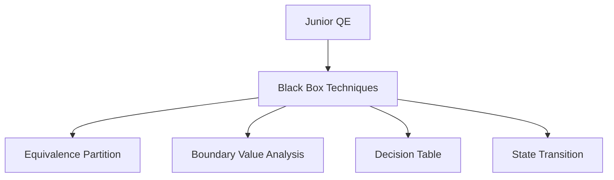

# QE Career Roadmap - Library Research & Analysis

## Current Implementation Issues

After analyzing `/Users/luis.osuna/QE-Site/index.html`, I identified these critical problems:

### Problems with Custom Implementation
1. **Complex Layout System**: Uses flexbox rows with left/right branches, requiring manual positioning
2. **Fragile Connector Logic**: JavaScript draws SVG lines by calculating bounding boxes - breaks easily when content changes
3. **Poor Scalability**: Adding new nodes requires updating HTML structure, CSS classes, data attributes, AND connector logic
4. **Maintenance Nightmare**: 3000+ lines of HTML with deeply nested structures
5. **No Automatic Layout**: Manual spacing adjustments needed for every change
6. **Alignment Issues**: Gaps and misalignments occur when node sizes vary

## Library Evaluation for Static GitHub Pages

### Requirements
- ✅ Works without build process (vanilla JS via CDN)
- ✅ Clean, professional appearance
- ✅ Automatic layout & connector routing
- ✅ Handles hierarchical roadmap structure
- ✅ Low maintenance overhead

---

## Option 1: Mermaid.js ⭐ RECOMMENDED

### Pros
- ✅ **Zero build process** - Simple CDN include
- ✅ **Text-based syntax** - Define diagrams in markdown-like syntax
- ✅ **Automatic layout** - No manual positioning needed
- ✅ **82K+ GitHub stars** - Battle-tested and actively maintained
- ✅ **Multiple diagram types** - Flowchart, Gantt, Timeline, etc.
- ✅ **Theme support** - Built-in dark/light themes
- ✅ **Excellent documentation** - Extensive examples and guides

### Cons
- ⚠️ Limited layout customization for very complex hierarchies
- ⚠️ Text-based means less fine-grained control over exact positioning

### Use Case Fit: ⭐⭐⭐⭐⭐ (5/5)
Perfect for career roadmaps. The flowchart syntax naturally represents hierarchical skill progression.

### CDN Integration
```html
<script type="module">
  import mermaid from 'https://cdn.jsdelivr.net/npm/mermaid@11/dist/mermaid.esm.min.mjs';
  mermaid.initialize({ startOnLoad: true, theme: 'dark' });
</script>
```

---

## Option 2: React Flow

### Pros
- ✅ Highly customizable nodes and edges
- ✅ Professional appearance
- ✅ Interactive features (zoom, pan, drag)
- ✅ Good documentation

### Cons
- ❌ **Requires React** - Not suitable for static HTML
- ❌ Needs build process (webpack, vite, etc.)
- ❌ Adds ~200KB+ to bundle size
- ❌ Overkill for static roadmap display

### Use Case Fit: ⭐⭐ (2/5)
Excellent library, but wrong tool for a static GitHub Pages site.

---

## Option 3: Vue Flow

### Pros
- ✅ Similar features to React Flow
- ✅ Vue 3 composition API integration

### Cons
- ❌ **Requires Vue.js** - Not suitable for static HTML
- ❌ Needs build process
- ❌ Similar bundle size concerns as React Flow

### Use Case Fit: ⭐⭐ (2/5)
Same limitations as React Flow for this use case.

---

## Option 4: Flowy.js

### Pros
- ✅ Vanilla JavaScript - No framework required
- ✅ Drag-and-drop functionality
- ✅ Lightweight (~50KB)
- ✅ Simple CDN integration

### Cons
- ⚠️ Primarily designed for interactive flow builders, not static displays
- ⚠️ Less mature (fewer stars, smaller community)
- ⚠️ Manual node positioning still required

### Use Case Fit: ⭐⭐⭐ (3/5)
Could work, but focused on interactive editing rather than static display.

---

## Option 5: flowchart.js

### Pros
- ✅ Text-based syntax (similar to Mermaid)
- ✅ Uses Raphaël for SVG rendering
- ✅ CDN available

### Cons
- ⚠️ Less actively maintained
- ⚠️ Limited diagram types
- ⚠️ Smaller community than Mermaid
- ⚠️ Less polished appearance

### Use Case Fit: ⭐⭐⭐ (3/5)
Similar concept to Mermaid but less mature and less actively developed.

---

## Option 6: JointJS / GoJS

### Pros
- ✅ Feature-rich professional diagramming
- ✅ Excellent rendering quality
- ✅ Highly customizable

### Cons
- ❌ **Commercial license required** for most use cases
- ❌ Steep learning curve
- ❌ Overkill for static career roadmap
- ❌ Large library size

### Use Case Fit: ⭐⭐ (2/5)
Too heavyweight and expensive for this use case.

---

## Option 7: D3.js

### Pros
- ✅ Maximum flexibility
- ✅ Beautiful visualizations possible
- ✅ Large community

### Cons
- ❌ **Very steep learning curve** - Low-level API
- ❌ Requires significant custom code for layouts
- ❌ No built-in roadmap/flowchart patterns
- ❌ More code to maintain than current implementation

### Use Case Fit: ⭐ (1/5)
Would solve nothing - requires even more custom code than current approach.

---

## Option 8: Pure CSS Tree Diagrams

### Pros
- ✅ Zero JavaScript
- ✅ Very lightweight
- ✅ SEO-friendly

### Cons
- ❌ Limited to simple tree structures
- ❌ No connector line styling control
- ❌ Difficult to achieve professional appearance
- ❌ Limited interactivity

### Use Case Fit: ⭐⭐ (2/5)
Too simplistic for the complexity needed.

---

## RECOMMENDATION: Mermaid.js

### Why Mermaid.js Wins

1. **Zero Build Process**: Drop in via CDN, works immediately
2. **Declarative Syntax**: Define structure in clean text format
3. **Automatic Layout**: No manual positioning or connector math
4. **Maintainable**: Update roadmap by editing text, not HTML structure
5. **Professional**: Clean, modern appearance out of the box
6. **Proven**: Used by GitHub, GitLab, Notion, and thousands of projects

### Data Structure Example

Instead of 500 lines of nested HTML divs:



### Migration Effort

- **Current**: 3000+ lines of HTML, CSS, and JavaScript
- **Mermaid**: ~200 lines of clean text-based definitions
- **Reduction**: ~93% less code to maintain

### Will It Solve the Issues?

✅ **Layout gaps**: Mermaid automatically spaces nodes
✅ **Connector lines**: Built-in, automatic, always correct
✅ **Professional design**: Themed, consistent styling
✅ **Maintenance**: Text-based, version control friendly
✅ **Alignment**: Handled by layout algorithm

---

## Implementation Strategy

### Phase 1: Proof of Concept (Recommended First Step)
Create a single-tab demo with Mermaid to validate the approach

### Phase 2: Full Migration
Convert QE and SDET roadmaps to Mermaid syntax

### Phase 3: Enhancement
Add interactive features like tooltips, clickable nodes with details

---

## Alternative: Hybrid Approach

Keep the Guide tab as-is (working well), replace only the roadmap tabs with Mermaid.

This gives you:
- Clean, maintainable roadmaps
- Professional appearance
- Easy updates
- Minimal risk (Guide tab unchanged)

---

## Sources

- [Mermaid.js Guide 2026](https://www.w3resource.com/javascript/mermaid-js-guide-to-create-diagrams-as-code.php)
- [Mermaid GitHub Repository](https://github.com/mermaid-js/mermaid) - 82K+ stars
- [React Flow CDN](https://cdnjs.com/libraries/react-flow-renderer)
- [Vue Flow](https://vueflow.dev/)
- [10 Best Flowchart Libraries 2026](https://www.jqueryscript.net/blog/best-flowchart.html)
- [JavaScript Diagram Libraries Comparison](https://modeling-languages.com/javascript-drawing-libraries-diagrams/)
- [Flowy.js](https://github.com/alyssaxuu/flowy)
- [JointJS](https://www.jointjs.com/)

---

## Next Steps

1. Review this analysis
2. Approve Mermaid.js approach
3. Create proof of concept for one roadmap section
4. If successful, migrate full roadmaps
5. Deploy improved version
